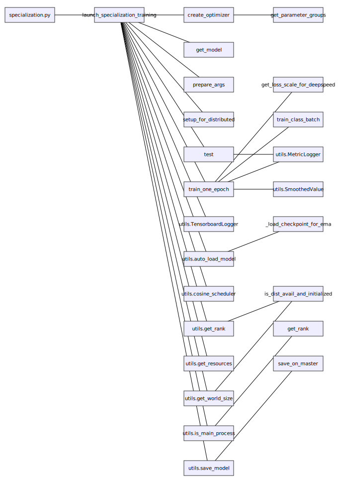
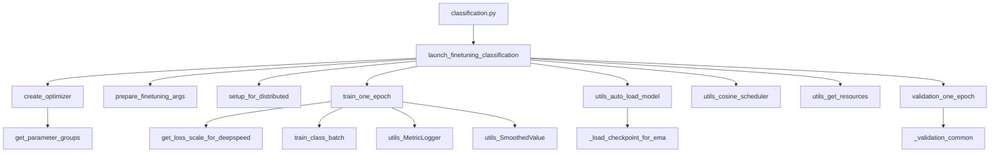
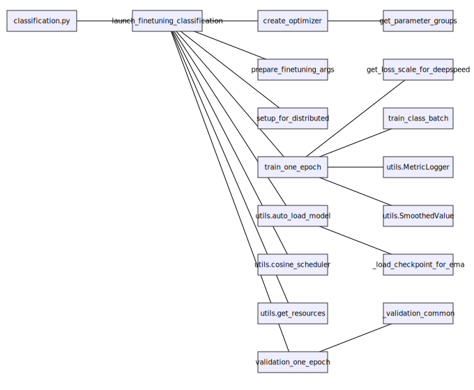
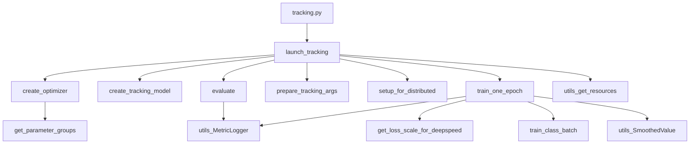
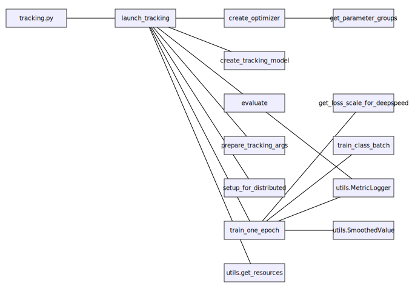

# High-Level Training Call Tree
## specialization.py
### Imports
- arguments.Args
- arguments.prepare_args
- engine_for_pretraining.test
- engine_for_pretraining.train_one_epoch
- model_analysis.get_dataloader
- model_analysis.get_dataset_dataloader
- optim_factory.create_optimizer
- utils
- utils.NativeScalerWithGradNormCount
- utils.get_model
- utils.multiple_pretrain_samples_collate
- utils.setup_for_distributed

### `launch_specialization_training` flow
- create_optimizer
  - get_parameter_groups
- get_model
- prepare_args
- setup_for_distributed: This function disables printing when not in master process
- test
  - utils.MetricLogger
- train_one_epoch
  - get_loss_scale_for_deepspeed
  - train_class_batch
  - utils.MetricLogger
  - utils.SmoothedValue
- utils.TensorboardLogger
- utils.auto_load_model
  - _load_checkpoint_for_ema: Workaround for ModelEma._load_checkpoint to accept an already-loaded object
- utils.cosine_scheduler
- utils.get_rank
  - is_dist_avail_and_initialized
- utils.get_resources
- utils.get_world_size
  - is_dist_avail_and_initialized
- utils.is_main_process
  - get_rank
- utils.save_model
  - save_on_master

```mermaid
graph TD
    specialization_py[specialization.py] --> launch_specialization_training
    launch_specialization_training --> create_optimizer
    create_optimizer --> get_parameter_groups
    launch_specialization_training --> get_model
    launch_specialization_training --> prepare_args
    launch_specialization_training --> setup_for_distributed
    launch_specialization_training --> test
    test --> utils_MetricLogger
    launch_specialization_training --> train_one_epoch
    train_one_epoch --> get_loss_scale_for_deepspeed
    train_one_epoch --> train_class_batch
    train_one_epoch --> utils_MetricLogger
    train_one_epoch --> utils_SmoothedValue
    launch_specialization_training --> utils_TensorboardLogger
    launch_specialization_training --> utils_auto_load_model
    utils_auto_load_model --> _load_checkpoint_for_ema
    launch_specialization_training --> utils_cosine_scheduler
    launch_specialization_training --> utils_get_rank
    utils_get_rank --> is_dist_avail_and_initialized
    launch_specialization_training --> utils_get_resources
    launch_specialization_training --> utils_get_world_size
    utils_get_world_size --> is_dist_avail_and_initialized
    launch_specialization_training --> utils_is_main_process
    utils_is_main_process --> get_rank
    launch_specialization_training --> utils_save_model
    utils_save_model --> save_on_master
```

## classification.py
### Imports
- arguments.Args
- arguments.prepare_finetuning_args
- dataset.build_dataset
- dataset.data_manager.DataManager
- engine_for_finetuning.final_test
- engine_for_finetuning.train_one_epoch
- engine_for_finetuning.validation_one_epoch
- engine_for_pretraining.test
- engine_for_pretraining.train_one_epoch
- models
- optim_factory.create_optimizer
- utils
- utils.NativeScalerWithGradNormCount
- utils.multiple_pretrain_samples_collate
- utils.setup_for_distributed

### `launch_finetuning_classification` flow
- create_optimizer
  - get_parameter_groups
- prepare_finetuning_args
- setup_for_distributed: This function disables printing when not in master process
- train_one_epoch
  - get_loss_scale_for_deepspeed
  - train_class_batch
  - utils.MetricLogger
  - utils.SmoothedValue
- utils.auto_load_model
  - _load_checkpoint_for_ema: Workaround for ModelEma._load_checkpoint to accept an already-loaded object
- utils.cosine_scheduler
- utils.get_resources
- validation_one_epoch
  - _validation_common: Core validation loop shared by collect/collect_logits.

## tracking.py
### Imports
- arguments.prepare_tracking_args
- dataset.data_manager.DataManager
- dataset.tracking_dataset.MedicanesTrackDataset
- engine_for_tracking.evaluate
- engine_for_tracking.train_one_epoch
- models.tracking_model.RegressionHead
- models.tracking_model.create_tracking_model
- optim_factory.create_optimizer
- utils
- utils.setup_for_distributed

### `launch_tracking` flow
- create_optimizer
  - get_parameter_groups
- create_tracking_model: Build a model for cyclone tracking starting from a classification checkpoint.
- evaluate: Evaluate the model.
  - utils.MetricLogger
- prepare_tracking_args
- setup_for_distributed: This function disables printing when not in master process
- train_one_epoch
  - get_loss_scale_for_deepspeed
  - train_class_batch
  - utils.MetricLogger
  - utils.SmoothedValue
- utils.get_resources

